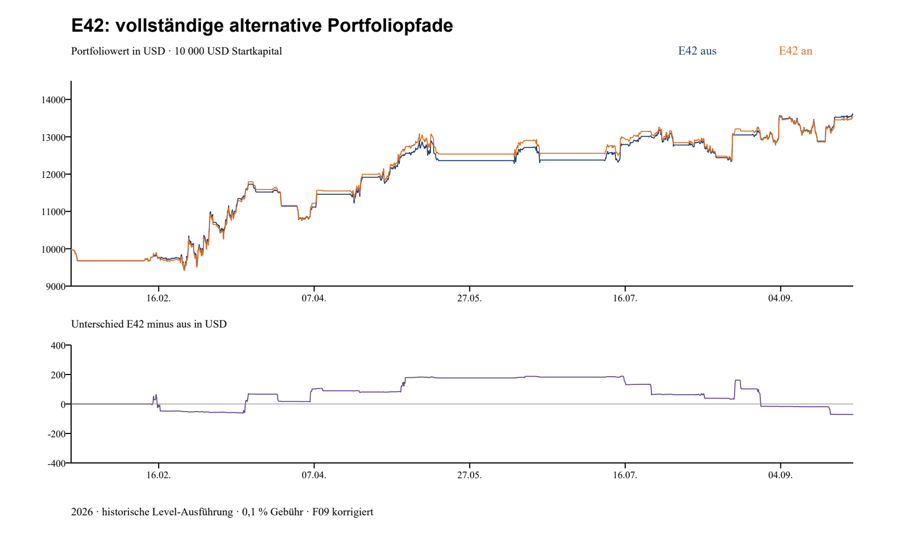

# E42: vollständige Fallanalyse

**Ergebnis:** Ein gehaltener Rücktest ist eine vergangene Preisbedingung, keine Zusage für den nächsten Kurs. Im gespeicherten Lauf ergeben 16 tatsächliche Rückkauf-Signale sechs positive und zehn negative Rückkauf-Lose. Zusammen verdienen diese Lose nach den modellierten Gebühren 13,45 USD. Trotzdem endet das Gesamtportfolio 71,53 USD unter der Vergleichsstrategie ohne E42.

## Basis, Zeit und Zählung

Original-E44.5-Eingaben und Signale, Code 68e15ae (Engine identisch mit e2b0051). Die Originalsignale wurden mit instrumentierter Zustandsmaschine exakt rekonstruiert. Die nachstehende Losrechnung korrigiert ausschließlich F09 (winzige verbleibende BTC-Reste) durch unabhängige Buchführung. Sie enthält zunächst auch die ursprüngliche unvollständige Schlusskerze, um den gespeicherten Lauf zu erklären. Die getrennte gemeinsame Messung in [KOMBINATIONEN.md](KOMBINATIONEN.md) entfernt diese Kerze.

Alle Tabellenzeiten sind **UTC 2026, Beginn der 4h-Kerze**. Das Schluss-Signal ist frühestens vier Stunden später bekannt, zuzüglich Abruf- und Versandverzögerung. Ein historischer Tabellenpreis ist keine belegte Broker-Ausführung. Gebühren 0,1 % je Kauf/Verkauf, kein Spread/Funding im ursprünglichen Modell. Teilverkäufe werden proportional auf alle offenen Kauf-Lose verteilt; ein Rückkauf-Stop verkauft nur Rückkauf-Lose. Sämtliche Rückkäufe dieses Laufs sind vor dessen Ende geschlossen.

**57 Beobachtungen → 33 Ausbruchsereignisse → 16 Rückkäufe.** Beobachtung = Startzeit plus Marke. Ausbruchsereignis = neuer Schluss jenseits der Marke, während noch kein Ausbruch aktiv ist; nach Scheitern kann ein neuer Ausbruch derselben Beobachtung beginnen. Wiederholte Kerzen eines laufenden Ausbruchs werden nicht neu gezählt. Es gab 18 Ausbruchsereignisse mit mindestens einem gehaltenen Rücktest und 19 entsprechende Kerzen. Zwei gehaltene Ereignisse führten nicht zum Kauf: B004 blieb wegen vollem Planbestand gesperrt; bei B016 verhinderte ein Teilverkauf derselben Kerze den Kauf durch no_flip, danach brach die Marke. Die Endzustände sind gegenseitig ausschließend:

| Endzustand | Anzahl |
|---|---:|
| Schluss unter Marke | 9 |
| Rückkauf | 16 |
| gehalten, kein Kauf | 1 |
| durch neue Beobachtung ersetzt | 5 |
| Frist abgelaufen | 2 |

**Ein Ausbruch wird noch in derselben Kerze ersetzt:** B011/O021, 07.04. 20:00 UTC, Marke 69.310. Ein Hoch-Verkauf beginnt diese Beobachtung, der nachfolgende Restverkauf setzt die endgültige Marke auf 72.026,09 (O020). B011 ist damit eine tatsächlich erzeugte, aber sofort überholte Ausbruchsmeldung. Nur 32 der 33 Ausbruchsereignisse werden über diese Kerze hinaus beobachtet. Eine unabhängige Aufzeichnung der verschachtelten Beginnen-/Beenden-Aufrufe bestätigt diese Reihenfolge und unveränderte Originalsignale. Die frühere Audit-Zuordnung von O021 als bis Datenende offen und B011 bis 09.04. wurde korrigiert; Renditen und Zählung der Rückkäufe bleiben gleich.

18/33 wäre **keine belastbare Erfolgsquote**: gehalten beschreibt nur die Rücktest-Kerze; Ersetzen und Fristablauf sind andere Endzustände. Die 57 Beobachtungen, 33 Ausbrüche und 19 Rücktest-Kerzen dürfen nicht zusammen in einen gemeinsamen Nenner wandern. Auch 6/16 profitable Lose sind bei abhängigen Marktereignissen kein belastbarer Schätzer künftiger Trefferwahrscheinlichkeit.

## Rückkauf-Lose: vollständig

| Ereignis | Kaufkerze UTC | Marke USD | Modellpreis USD | eingesetzte USD | gekaufte BTC | Gebühren USD | Nettoergebnis USD | Ergebnis auf Einsatz % |
|---|---|---:|---:|---:|---:|---:|---:|---:|
| B003 | 13.02. 16:00 | 68 410,52 | 68 938,91 | 2 419,59 | 0.03506251 | 4,79 | -47,06 | -1,94 |
| B005 | 15.03. 00:00 | 70 983,00 | 71 363,14 | 2 821,18 | 0.03949321 | 5,78 | 131,71 | 4,67 |
| B006 | 26.03. 04:00 | 69 988,83 | 70 087,44 | 2 896,48 | 0.04128537 | 5,75 | -47,23 | -1,63 |
| B009 | 05.04. 16:00 | 67 288,94 | 67 361,01 | 2 708,35 | 0.04016626 | 5,51 | 88,88 | 3,28 |
| B012 | 09.04. 16:00 | 72 026,09 | 72 096,32 | 2 891,30 | 0.04006314 | 5,77 | -15,38 | -0,53 |
| B015 | 21.04. 08:00 | 76 000,00 | 76 452,94 | 573,51 | 0.00749399 | 1,14 | -11,85 | -2,07 |
| B017 | 04.05. 20:00 | 79 360,00 | 79 861,01 | 2 998,96 | 0.03751465 | 6,09 | 93,76 | 3,13 |
| B018 | 13.06. 16:00 | 64 234,68 | 64 296,59 | 3 134,35 | 0.04869961 | 6,27 | 1,64 | 0,05 |
| B021 | 15.07. 12:00 | 64 692,83 | 65 427,61 | 3 245,74 | 0.04955845 | 6,44 | -57,06 | -1,76 |
| B023 | 24.07. 00:00 | 64 967,25 | 65 456,70 | 3 286,16 | 0.05015331 | 6,51 | -68,27 | -2,08 |
| B025 | 07.08. 12:00 | 64 692,83 | 64 912,72 | 1 732,96 | 0.02667014 | 3,44 | -26,56 | -1,53 |
| B026 | 18.08. 12:00 | 64 234,68 | 64 855,06 | 1 539,39 | 0.02371217 | 3,15 | 73,08 | 4,75 |
| B027 | 20.08. 00:00 | 68 698,70 | 69 195,64 | 3 270,88 | 0.04722279 | 6,67 | 126,65 | 3,87 |
| B030 | 22.08. 00:00 | 77 904,93 | 78 410,98 | 3 302,54 | 0.04207627 | 6,55 | -59,44 | -1,80 |
| B031 | 27.08. 12:00 | 79 199,48 | 80 302,32 | 3 287,68 | 0.04090038 | 6,46 | -117,80 | -3,58 |
| B033 | 19.09. 12:00 | 81 272,62 | 81 636,01 | 3 215,91 | 0.03935386 | 6,38 | -51,63 | -1,61 |

Alle Käufe tragen eine angeforderte Tranche von 25 %; die absoluten Einsätze unterscheiden sich durch Wiederanlage, vorhandenes Cash und den ursprünglichen Zyklus-Bezugsbetrag. 25 % ist deshalb weder immer ein Viertel des momentanen Portfoliowerts noch ein Viertel des freien Cash. Kosten sind im Nettoergebnis bereits enthalten.

### Sämtliche Teilverkäufe und Stops je Rückkauf

| Los | Verkaufkerze UTC | Verkaufstyp | BTC dieses Loses | Preis USD | Erlös nach Gebühr USD | anteiliger Kaufaufwand USD | Nettoanteil USD |
|---|---|---|---:|---:|---:|---:|---:|
| B003 | 15.02. 20:00 | TEILVERKAUF_LADDER | 0.00525938 | 68 832,58 | 361,65 | 362,94 | -1,28 |
| B003 | 16.02. 12:00 | RUECKKAUF_STOP | 0.02980313 | 67 539,52 | 2 010,88 | 2 056,65 | -45,78 |
| B005 | 16.03. 04:00 | TEILVERKAUF_LADDER | 0.00592398 | 74 337,74 | 439,94 | 423,18 | 16,76 |
| B005 | 16.03. 20:00 | TEILVERKAUF_LADDER | 0.00592398 | 74 831,33 | 442,86 | 423,18 | 19,68 |
| B005 | 17.03. 00:00 | TEILVERKAUF_1 | 0.01579728 | 75 324,91 | 1 188,74 | 1 128,47 | 60,27 |
| B005 | 17.03. 00:00 | VERKAUF_REST | 0.01184796 | 74 463,98 | 881,36 | 846,35 | 35,01 |
| B006 | 26.03. 12:00 | RUECKKAUF_STOP | 0.04128537 | 69 082,64 | 2 849,25 | 2 896,48 | -47,23 |
| B009 | 06.04. 00:00 | TEILVERKAUF_LADDER | 0.00635398 | 69 160,12 | 439,00 | 428,44 | 10,56 |
| B009 | 06.04. 08:00 | TEILVERKAUF_LADDER | 0.00635398 | 69 591,12 | 441,74 | 428,44 | 13,30 |
| B009 | 06.04. 08:00 | TEILVERKAUF_1 | 0.01694395 | 70 022,12 | 1 185,27 | 1 142,50 | 42,76 |
| B009 | 06.04. 08:00 | VERKAUF_REST | 0.01051434 | 69 614,91 | 731,22 | 708,97 | 22,26 |
| B012 | 09.04. 20:00 | TEILVERKAUF_LADDER | 0.00600947 | 71 787,97 | 430,98 | 433,69 | -2,72 |
| B012 | 10.04. 00:00 | STOPLOSS | 0.03405367 | 71 868,67 | 2 444,94 | 2 457,60 | -12,66 |
| B015 | 21.04. 16:00 | RUECKKAUF_STOP | 0.00749399 | 75 023,43 | 561,66 | 573,51 | -11,85 |
| B017 | 06.05. 08:00 | VERKAUF_REST | 0.03751465 | 82 522,89 | 3 092,72 | 2 998,96 | 93,76 |
| B018 | 13.06. 20:00 | TEILVERKAUF_1 | 0.02783524 | 64 394,44 | 1 790,64 | 1 791,50 | -0,86 |
| B018 | 14.06. 00:00 | VERKAUF_REST | 0.02086437 | 64 545,30 | 1 345,35 | 1 342,85 | 2,50 |
| B021 | 15.07. 16:00 | TEILVERKAUF_LADDER | 0.00743377 | 64 977,34 | 482,54 | 486,86 | -4,32 |
| B021 | 16.07. 00:00 | TEILVERKAUF_LADDER | 0.00743377 | 64 619,95 | 479,89 | 486,86 | -6,97 |
| B021 | 16.07. 04:00 | STOPLOSS | 0.03469092 | 64 238,00 | 2 226,25 | 2 272,02 | -45,77 |
| B023 | 24.07. 16:00 | RUECKKAUF_STOP | 0.05015331 | 64 225,32 | 3 217,89 | 3 286,16 | -68,27 |
| B025 | 10.08. 16:00 | RUECKKAUF_STOP | 0.02667014 | 64 045,70 | 1 706,40 | 1 732,96 | -26,56 |
| B026 | 19.08. 12:00 | TEILVERKAUF_LADDER | 0.00355683 | 67 112,77 | 238,47 | 230,91 | 7,56 |
| B026 | 19.08. 12:00 | TEILVERKAUF_1 | 0.00948487 | 67 884,00 | 643,23 | 615,76 | 27,47 |
| B026 | 19.08. 12:00 | VERKAUF_REST | 0.01067048 | 68 554,00 | 730,77 | 692,73 | 38,05 |
| B027 | 20.08. 04:00 | TEILVERKAUF_LADDER | 0.00708342 | 69 816,45 | 494,04 | 490,63 | 3,41 |
| B027 | 20.08. 08:00 | TEILVERKAUF_LADDER | 0.00708342 | 71 927,07 | 508,98 | 490,63 | 18,35 |
| B027 | 20.08. 08:00 | TEILVERKAUF_LADDER | 0.00708342 | 71 987,14 | 509,41 | 490,63 | 18,77 |
| B027 | 20.08. 12:00 | TEILVERKAUF_LADDER | 0.00708342 | 72 372,75 | 512,13 | 490,63 | 21,50 |
| B027 | 20.08. 12:00 | TEILVERKAUF_1 | 0.01888911 | 72 758,37 | 1 372,97 | 1 308,35 | 64,61 |
| B030 | 22.08. 04:00 | TEILVERKAUF_LADDER | 0.00631144 | 77 289,18 | 487,32 | 495,38 | -8,06 |
| B030 | 22.08. 08:00 | STOPLOSS | 0.03576483 | 77 130,02 | 2 755,78 | 2 807,16 | -51,38 |
| B031 | 28.08. 16:00 | RUECKKAUF_STOP | 0.04090038 | 77 580,03 | 3 169,88 | 3 287,68 | -117,80 |
| B033 | 20.09. 00:00 | RUECKKAUF_STOP | 0.03935386 | 80 486,38 | 3 164,28 | 3 215,91 | -51,63 |

## Warum gehalten später Verlust machen kann

**B031, 27. August:** Nach dem Ausbruch vom 27.08. 08:00 hält die Rücktest-Kerze 27.08. 12:00 die Marke 79 199,48 USD. Gekauft wird zum Schluss 80 302,32 USD für 3 287,68 USD. Später verkauft RUECKKAUF_STOP am 28.08. 16:00 zu 77 580,03 USD. Ergebnis -117,80 USD nach 6,46 USD Gebühren. Der Rücktest war zum damaligen Schluss regelkonform; der spätere Kursverlauf erfüllt diese Bedingung nicht erneut. Das ist kein Widerspruch.

**B003, 13. Februar:** Der Rückkauf kostet 68 938,91 USD je BTC. Der spätere Verkauf „TEILVERKAUF_LADDER“ zu 68 832,58 USD liegt für dieses neue Los bereits unter seinem Kaufpreis. Die Bezeichnung Teilgewinn bezieht sich auf die Ziele der Gesamtposition, nicht zwangsläufig auf jeden später hinzugekauften Anteil. Zusammen mit dem Teil-Stop verliert dieses Los -47,06 USD. Eine Zählung aller „Teilgewinne“ als gewonnene Rückkäufe wäre falsch.

## Gewinn eines Teils gegenüber dem Gesamtportfolio

| Buchung | USD bei 10 000 USD Startkapital |
|---|---:|
| E42 aus: Endwert | 13 613,75 |
| E42 an: Endwert | 13 542,22 |
| Unterschied E42 minus aus | -71,53 |
| Direkte Nettoergebnisse aller Rückkauf-Lose | 13,45 |
| Unterschied der übrigen Lose | -84,98 |
| Gesamte Gebühren E42 aus / an | 546,34 / 632,33 |

Der zweite Effekt entsteht durch das veränderte verfügbare Cash, den Bestand und nachfolgende Signal-/Verkaufsfolgen. Die Zahl −84,98 USD ist eine exakte buchhalterische Zerlegung des Ergebnisunterschieds. Sie ist **keine getrennt identifizierte kausale Schätzung**, wie viel allein Cash-Bindung, ein bestimmter Kauf oder ein geänderter Stop verursacht. Gebühren nicht nochmals abziehen: Sie stecken bereits in den Losergebnissen.

Ein konkreter Gewinnfall ist **B027, 20. August**: dieses Los verdient 126,65 USD über fünf Verkäufe. Daraus folgt nicht, dass das gesamte E42-Paket den Pfad ohne E42 schlägt. Bei gleichem Kapital konkurrieren die zusätzlich gebundenen Mittel mit späteren Einstiegen; die Gesamtstrategie wird deshalb mit ihrem vollständigen alternativen Pfad verglichen. Ein sauberer Einzelfall-Nachweis „gerade B027 verursachte den späteren Minderertrag“ ist durch diese Zerlegung allein nicht gegeben und wird hier nicht behauptet.

**Konkrete Kapitalbindung bei einem später profitablen Rückkauf:** B005 vom 15.03. verdient am Ende 131,71 USD. Beim normalen Nachkauf am 15.03. 20:00 UTC stehen im Pfad ohne E42 davor 5.379,75 USD Cash bereit, mit E42 nur 2.530,00 USD. Der Nachkauf zu 72.815,24 umfasst 2.268,99 statt 2.256,94 USD; danach bleiben 3.110,75 gegenüber 273,05 USD frei. Der kleinere Bezugsbetrag enthält auch frühere Pfadunterschiede. Die Tabelle belegt gebundenes Kapital und geänderte Größen, nicht die kausale Verantwortung allein dieses einen Loses.

**Auch spätere Signalabsichten ändern sich:** Am 10.08. 16:00 UTC enthält der Pfad ohne E42 zwei Nachkäufe. Die Leiter-Order setzt die restlichen 1.724,46 USD zu 64.045,70 ein; die weitere 25-%-Order am 0,786-Level bleibt wegen leerem Cash eine Nullorder. Im E42-Pfad fehlen beide Signalabsichten. Ein Vergleich nur der 16 Rückkäufe würde diese Folgeänderung übersehen. Vollständige passende Orders mit abweichenden Größen und hinzugekommene/weggefallene Standard-Signaltypen: [e42-portfolio-unterschiede.json](e42-portfolio-unterschiede.json). Manche zusätzlichen Standard-STOPLOSS-Verkäufe schließen ausschließlich Rückkaufbestand; ihre Signalnamen allein definieren deshalb kein unabhängiges Kernportfolio.

## Alle 33 eindeutigen Ausbruchsereignisse

| ID / Beobachtung | Marke USD | Ausbruch UTC | erster gehaltener Rücktest UTC | Rücktest-Kerzen | Ende UTC | endgültiger Status |
|---|---:|---|---|---:|---|---|
| B001 / O002 | 93 092,00 | 19.01. 08:00 | — | 0 | 19.01. 12:00 | Schluss unter Marke |
| B002 / O002 | 93 092,00 | 19.01. 16:00 | — | 0 | 19.01. 20:00 | Schluss unter Marke |
| B003 / O003 | 68 410,52 | 13.02. 12:00 | 13.02. 16:00 | 1 | 13.02. 16:00 | Rückkauf |
| B004 / O006 | 68 199,99 | 09.03. 12:00 | 09.03. 16:00 | 1 | 09.03. 16:00 | gehalten, kein Kauf; die Engine ist schon voll investiert |
| B005 / O009 | 70 983,00 | 14.03. 20:00 | 15.03. 00:00 | 1 | 15.03. 00:00 | Rückkauf |
| B006 / O014 | 69 988,83 | 24.03. 20:00 | 26.03. 04:00 | 1 | 26.03. 04:00 | Rückkauf |
| B007 / O017 | 67 288,94 | 04.04. 12:00 | — | 0 | 04.04. 16:00 | Schluss unter Marke |
| B008 / O017 | 67 288,94 | 04.04. 20:00 | — | 0 | 05.04. 00:00 | Schluss unter Marke |
| B009 / O017 | 67 288,94 | 05.04. 12:00 | 05.04. 16:00 | 1 | 05.04. 16:00 | Rückkauf |
| B010 / O019 | 68 199,99 | 07.04. 16:00 | — | 0 | 07.04. 20:00 | durch neue Beobachtung ersetzt |
| B011 / O021 | 69 310,00 | 07.04. 20:00 | — | 0 | 07.04. 20:00 | durch neue Beobachtung ersetzt |
| B012 / O020 | 72 026,09 | 09.04. 12:00 | 09.04. 16:00 | 1 | 09.04. 16:00 | Rückkauf |
| B013 / O023 | 75 425,00 | 19.04. 08:00 | — | 0 | 19.04. 12:00 | durch neue Beobachtung ersetzt |
| B014 / O024 | 76 000,00 | 20.04. 16:00 | — | 0 | 20.04. 20:00 | Schluss unter Marke |
| B015 / O024 | 76 000,00 | 21.04. 04:00 | 21.04. 08:00 | 1 | 21.04. 08:00 | Rückkauf |
| B016 / O025 | 79 360,00 | 04.05. 00:00 | 04.05. 04:00 | 1 | 04.05. 08:00 | Schluss unter Marke |
| B017 / O025 | 79 360,00 | 04.05. 12:00 | 04.05. 16:00 | 2 | 04.05. 20:00 | Rückkauf |
| B018 / O030 | 64 234,68 | 13.06. 12:00 | 13.06. 16:00 | 1 | 13.06. 16:00 | Rückkauf |
| B019 / O031 | 67 288,94 | 15.06. 12:00 | — | 0 | 15.06. 16:00 | Schluss unter Marke |
| B020 / O035 | 63 239,06 | 10.07. 00:00 | — | 0 | 12.07. 00:00 | Frist abgelaufen |
| B021 / O036 | 64 692,83 | 15.07. 08:00 | 15.07. 12:00 | 1 | 15.07. 12:00 | Rückkauf |
| B022 / O040 | 63 461,99 | 17.07. 16:00 | — | 0 | 19.07. 16:00 | Frist abgelaufen |
| B023 / O042 | 64 967,25 | 23.07. 20:00 | 24.07. 00:00 | 1 | 24.07. 00:00 | Rückkauf |
| B024 / O043 | 64 692,83 | 06.08. 04:00 | — | 0 | 06.08. 08:00 | Schluss unter Marke |
| B025 / O043 | 64 692,83 | 07.08. 08:00 | 07.08. 12:00 | 1 | 07.08. 12:00 | Rückkauf |
| B026 / O044 | 64 234,68 | 18.08. 08:00 | 18.08. 12:00 | 1 | 18.08. 12:00 | Rückkauf |
| B027 / O045 | 68 698,70 | 19.08. 20:00 | 20.08. 00:00 | 1 | 20.08. 00:00 | Rückkauf |
| B028 / O046 | 69 310,00 | 20.08. 04:00 | — | 0 | 20.08. 08:00 | durch neue Beobachtung ersetzt |
| B029 / O047 | 69 988,83 | 20.08. 08:00 | — | 0 | 21.08. 04:00 | durch neue Beobachtung ersetzt |
| B030 / O048 | 77 904,93 | 21.08. 20:00 | 22.08. 00:00 | 1 | 22.08. 00:00 | Rückkauf |
| B031 / O051 | 79 199,48 | 27.08. 08:00 | 27.08. 12:00 | 1 | 27.08. 12:00 | Rückkauf |
| B032 / O053 | 80 200,00 | 06.09. 20:00 | — | 0 | 07.09. 00:00 | Schluss unter Marke |
| B033 / O055 | 81 272,62 | 19.09. 08:00 | 19.09. 12:00 | 1 | 19.09. 12:00 | Rückkauf |

## Alle 57 Beobachtungen, einschließlich solcher ohne Ausbruch

| ID | Beginn UTC | Marke USD | Ereignisse in Zeitfolge | Ende UTC | Ende der Beobachtung |
|---|---|---:|---|---|---|
| O001 | 19.01. 00:00 | 93 836,01 | kein Ausbruch/Rücktest | 19.01. 04:00 | neue_beobachtung |
| O002 | 19.01. 04:00 | 93 092,00 | Ausbruch 19.01. 08:00; Schluss unter Marke 19.01. 12:00; Ausbruch 19.01. 16:00; Schluss unter Marke 19.01. 20:00 | 20.01. 20:00 | beobachtung_beendet |
| O003 | 13.02. 12:00 | 68 410,52 | Ausbruch 13.02. 12:00; Rücktest gehalten 13.02. 16:00 | 13.02. 16:00 | beobachtung_beendet |
| O004 | 05.03. 12:00 | 72 271,41 | kein Ausbruch/Rücktest | 06.03. 20:00 | neue_beobachtung |
| O005 | 06.03. 20:00 | 68 199,99 | kein Ausbruch/Rücktest | 07.03. 04:00 | neue_beobachtung |
| O006 | 07.03. 04:00 | 68 199,99 | Ausbruch 09.03. 12:00; Rücktest gehalten 09.03. 16:00 | 09.03. 16:00 | beobachtung_beendet |
| O007 | 13.03. 12:00 | 72 271,41 | kein Ausbruch/Rücktest | 14.03. 12:00 | neue_beobachtung |
| O008 | 14.03. 12:00 | 70 983,00 | kein Ausbruch/Rücktest | 14.03. 16:00 | neue_beobachtung |
| O009 | 14.03. 16:00 | 70 983,00 | Ausbruch 14.03. 20:00; Rücktest gehalten 15.03. 00:00 | 15.03. 00:00 | beobachtung_beendet |
| O010 | 17.03. 00:00 | 79 360,00 | kein Ausbruch/Rücktest | 18.03. 16:00 | neue_beobachtung |
| O011 | 18.03. 16:00 | 71 777,00 | kein Ausbruch/Rücktest | 19.03. 00:00 | neue_beobachtung |
| O012 | 19.03. 00:00 | 71 777,00 | kein Ausbruch/Rücktest | 19.03. 08:00 | beobachtung_beendet |
| O013 | 24.03. 16:00 | 69 988,83 | kein Ausbruch/Rücktest | 24.03. 20:00 | neue_beobachtung |
| O014 | 24.03. 20:00 | 69 988,83 | Ausbruch 24.03. 20:00; Rücktest gehalten 26.03. 04:00 | 26.03. 04:00 | beobachtung_beendet |
| O015 | 02.04. 00:00 | 68 199,99 | kein Ausbruch/Rücktest | 02.04. 04:00 | beobachtung_beendet |
| O016 | 03.04. 00:00 | 67 288,94 | kein Ausbruch/Rücktest | 03.04. 04:00 | neue_beobachtung |
| O017 | 03.04. 04:00 | 67 288,94 | Ausbruch 04.04. 12:00; Schluss unter Marke 04.04. 16:00; Ausbruch 04.04. 20:00; Schluss unter Marke 05.04. 00:00; Ausbruch 05.04. 12:00; Rücktest gehalten 05.04. 16:00 | 05.04. 16:00 | beobachtung_beendet |
| O018 | 06.04. 08:00 | 69 988,83 | kein Ausbruch/Rücktest | 07.04. 16:00 | neue_beobachtung |
| O019 | 07.04. 16:00 | 68 199,99 | Ausbruch 07.04. 16:00 | 07.04. 20:00 | neue_beobachtung |
| O020 | 07.04. 20:00 | 72 026,09 | Ausbruch 09.04. 12:00; Rücktest gehalten 09.04. 16:00 | 09.04. 16:00 | beobachtung_beendet |
| O021 | 07.04. 20:00 | 69 310,00 | Ausbruch 07.04. 20:00 | 07.04. 20:00 | neue_beobachtung |
| O022 | 09.04. 20:00 | 72 271,41 | kein Ausbruch/Rücktest | 10.04. 00:00 | beobachtung_beendet |
| O023 | 19.04. 08:00 | 75 425,00 | Ausbruch 19.04. 08:00 | 19.04. 12:00 | neue_beobachtung |
| O024 | 19.04. 12:00 | 76 000,00 | Ausbruch 20.04. 16:00; Schluss unter Marke 20.04. 20:00; Ausbruch 21.04. 04:00; Rücktest gehalten 21.04. 08:00 | 21.04. 08:00 | beobachtung_beendet |
| O025 | 22.04. 12:00 | 79 360,00 | Ausbruch 04.05. 00:00; Rücktest gehalten 04.05. 04:00; Schluss unter Marke 04.05. 08:00; Ausbruch 04.05. 12:00; Rücktest gehalten 04.05. 16:00; Rücktest gehalten 04.05. 20:00 | 04.05. 20:00 | beobachtung_beendet |
| O026 | 06.05. 08:00 | 89 228,00 | kein Ausbruch/Rücktest | 10.05. 20:00 | neue_beobachtung |
| O027 | 10.05. 20:00 | 82 850,00 | kein Ausbruch/Rücktest | 11.05. 16:00 | neue_beobachtung |
| O028 | 11.05. 16:00 | 82 479,32 | kein Ausbruch/Rücktest | 17.05. 00:00 | beobachtung_beendet |
| O029 | 11.06. 16:00 | 64 234,68 | kein Ausbruch/Rücktest | 12.06. 08:00 | neue_beobachtung |
| O030 | 12.06. 08:00 | 64 234,68 | Ausbruch 13.06. 12:00; Rücktest gehalten 13.06. 16:00 | 13.06. 16:00 | beobachtung_beendet |
| O031 | 14.06. 00:00 | 67 288,94 | Ausbruch 15.06. 12:00; Schluss unter Marke 15.06. 16:00 | 17.06. 20:00 | neue_beobachtung |
| O032 | 17.06. 20:00 | 64 762,77 | kein Ausbruch/Rücktest | 18.06. 00:00 | neue_beobachtung |
| O033 | 18.06. 00:00 | 64 762,77 | kein Ausbruch/Rücktest | 18.06. 16:00 | beobachtung_beendet |
| O034 | 09.07. 20:00 | 63 461,99 | kein Ausbruch/Rücktest | 10.07. 00:00 | neue_beobachtung |
| O035 | 10.07. 00:00 | 63 239,06 | Ausbruch 10.07. 00:00; Frist abgelaufen 12.07. 00:00 | 12.07. 00:00 | beobachtung_beendet |
| O036 | 15.07. 04:00 | 64 692,83 | Ausbruch 15.07. 08:00; Rücktest gehalten 15.07. 12:00 | 15.07. 12:00 | beobachtung_beendet |
| O037 | 15.07. 16:00 | 65 622,83 | kein Ausbruch/Rücktest | 16.07. 00:00 | neue_beobachtung |
| O038 | 16.07. 00:00 | 64 762,77 | kein Ausbruch/Rücktest | 16.07. 04:00 | beobachtung_beendet |
| O039 | 17.07. 12:00 | 63 461,99 | kein Ausbruch/Rücktest | 17.07. 16:00 | neue_beobachtung |
| O040 | 17.07. 16:00 | 63 461,99 | Ausbruch 17.07. 16:00; Frist abgelaufen 19.07. 16:00 | 19.07. 16:00 | beobachtung_beendet |
| O041 | 23.07. 16:00 | 64 967,25 | kein Ausbruch/Rücktest | 23.07. 20:00 | neue_beobachtung |
| O042 | 23.07. 20:00 | 64 967,25 | Ausbruch 23.07. 20:00; Rücktest gehalten 24.07. 00:00 | 24.07. 00:00 | beobachtung_beendet |
| O043 | 06.08. 00:00 | 64 692,83 | Ausbruch 06.08. 04:00; Schluss unter Marke 06.08. 08:00; Ausbruch 07.08. 08:00; Rücktest gehalten 07.08. 12:00 | 07.08. 12:00 | beobachtung_beendet |
| O044 | 18.08. 04:00 | 64 234,68 | Ausbruch 18.08. 08:00; Rücktest gehalten 18.08. 12:00 | 18.08. 12:00 | beobachtung_beendet |
| O045 | 19.08. 12:00 | 68 698,70 | Ausbruch 19.08. 20:00; Rücktest gehalten 20.08. 00:00 | 20.08. 00:00 | beobachtung_beendet |
| O046 | 20.08. 04:00 | 69 310,00 | Ausbruch 20.08. 04:00 | 20.08. 08:00 | neue_beobachtung |
| O047 | 20.08. 08:00 | 69 988,83 | Ausbruch 20.08. 08:00 | 21.08. 04:00 | neue_beobachtung |
| O048 | 21.08. 04:00 | 77 904,93 | Ausbruch 21.08. 20:00; Rücktest gehalten 22.08. 00:00 | 22.08. 00:00 | beobachtung_beendet |
| O049 | 22.08. 04:00 | 78 599,99 | kein Ausbruch/Rücktest | 22.08. 08:00 | beobachtung_beendet |
| O050 | 26.08. 04:00 | 79 199,48 | kein Ausbruch/Rücktest | 26.08. 08:00 | neue_beobachtung |
| O051 | 26.08. 08:00 | 79 199,48 | Ausbruch 27.08. 08:00; Rücktest gehalten 27.08. 12:00 | 27.08. 12:00 | beobachtung_beendet |
| O052 | 06.09. 16:00 | 80 200,00 | kein Ausbruch/Rücktest | 06.09. 20:00 | neue_beobachtung |
| O053 | 06.09. 20:00 | 80 200,00 | Ausbruch 06.09. 20:00; Schluss unter Marke 07.09. 00:00 | 15.09. 20:00 | beobachtung_beendet |
| O054 | 18.09. 16:00 | 81 272,62 | kein Ausbruch/Rücktest | 18.09. 20:00 | neue_beobachtung |
| O055 | 18.09. 20:00 | 81 272,62 | Ausbruch 19.09. 08:00; Rücktest gehalten 19.09. 12:00 | 19.09. 12:00 | beobachtung_beendet |
| O056 | 21.09. 08:00 | 89 228,00 | kein Ausbruch/Rücktest | 27.09. 08:00 | neue_beobachtung |
| O057 | 27.09. 08:00 | 85 255,00 | kein Ausbruch/Rücktest | — | am_datenende_offen |

## Unsicherheit und Reproduktion

Auf der bereinigten gemeinsamen Datenbasis liegt E42 allein bei +35,42 % gegenüber +36,13 %. Paarweise Block-Neuziehung der 4h-Portfoliorenditen (2 000 Ziehungen, feste Startzahl 270926) ergibt für den Renditeunterschied ein 95-%-Perzentilband von ungefähr −6,08 bis +6,15 Prozentpunkten bei 7-Tage-Blöcken und −5,53 bis +5,88 bei 28-Tage-Blöcken. Diese bedingten Sensitivitätsbänder sind wegen derselben oft verwendeten Historie, weniger langer Zeitblöcke und nicht neu berechneter Signalsuche keine Zukunfts-Garantie und kein exakter Signifikanztest.

Die Schlussfolgerung lautet: **kein belastbarer Nachweis eines Mehrertrags durch E42; zugleich kein belastbarer Beweis, dass gehaltene Rücktests grundsätzlich nutzlos wären.** Das vorab getestete Zusammenspiel mit ausgeschaltetem Verkauf am alten Hoch verdient eine neue, unabhängige Prüfung erst nach Fehlerkorrektur. Es besteht die Audit-Kombinationsregel hier nicht.

Nachstellen: zuerst `python audit/e42_trace_check.py`, dann `python audit/e42_cases.py` und `python audit/e42_report.py`. Maschinenlesbare vollständige Zustandsübergänge, Nachrichtengründe und beide Portfoliopfade stehen in [e42-faelle.json](e42-faelle.json); die zusätzliche Laufzeitkontrolle in [e42-ablaufkontrolle.json](e42-ablaufkontrolle.json). Präfix der Originalsignale bleibt unverändert; `audit_episode` ist nur eine Audit-Zuordnung. Kosten-/Zeitvarianten und Zeitabschnitte: [KOMBINATIONEN.md](KOMBINATIONEN.md), [unsicherheit.json](unsicherheit.json).
